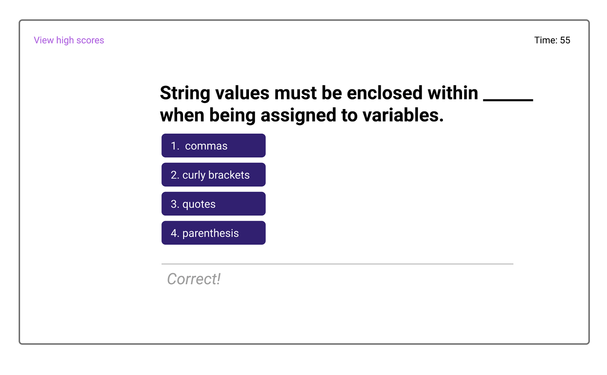
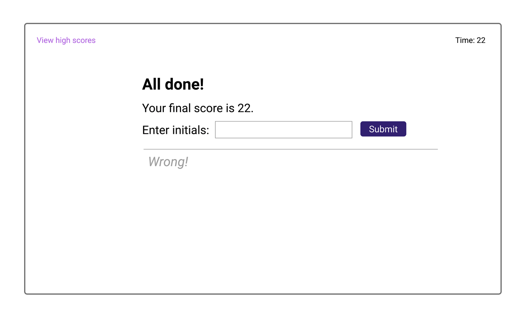
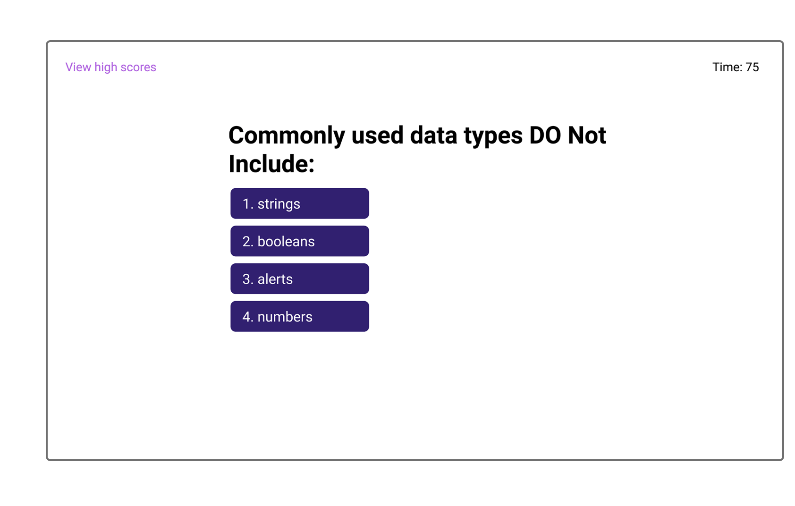

# code-quiz

This is a single page app that is a quiz on coding related questions.
It is a timed coding quiz with multiple-choice questions. This app will run in the browser, and will feature dynamically updated HTML and CSS powered by JavaScript code.
Each answer will be saved in local storage and an updated score will be presented on the final page.

Link to deployed app can be found here:
http://vianvianc.github.io/code-quiz

Website mockup:

The following screenshots demonstrate the apps functionality.

GIVEN I am taking a code quiz
WHEN I click the start button
THEN a timer starts and I am presented with a question
WHEN I answer a question
THEN I am presented with another question
WHEN I answer a question incorrectly
THEN time is subtracted from the clock
WHEN all questions are answered or the timer reaches 0
THEN the game is over
WHEN the game is over
THEN I can save my initials and score
